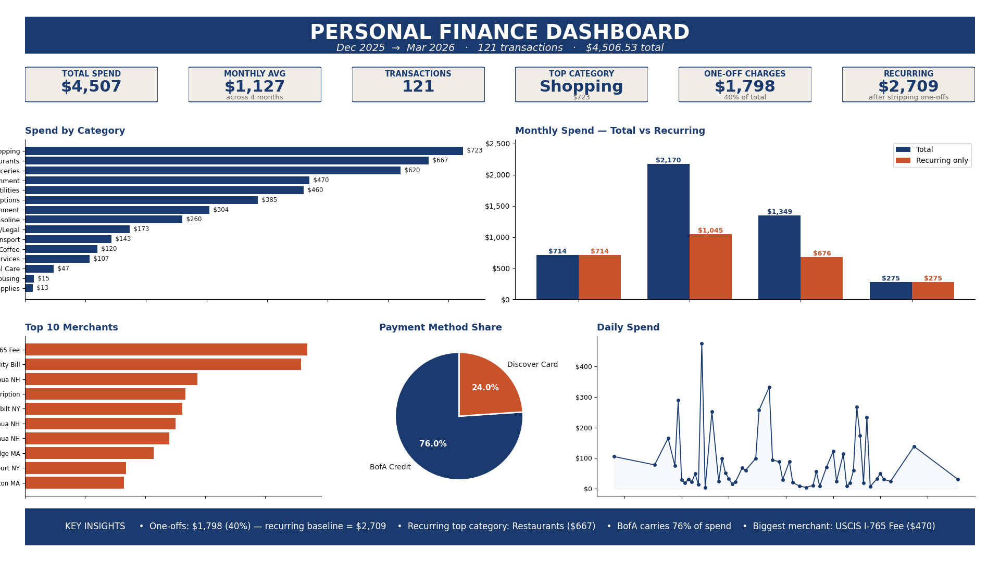

# Personal Finance & Expense Analysis — OSEMN Portfolio Project


> **🌐 [Open the live dashboard →](https://tmoganti.github.io/personal-finance-expense-analysis/spending_dashboard.html)**
> Modern web view with month tabs, hover tooltips, recurring-vs-one-off insight strip, and FICO + checking-balance panels. Runs entirely in the browser — zero install.



A portfolio-ready personal finance analysis built on the **OSEMN** framework
(Obtain → Scrub → Explore → Model → iNterpret) over my own transaction feed.

It answers four questions:

1. How much am I spending each month?
2. Which categories take most of my money?
3. Are my expenses increasing over time?
4. Where can I reduce spending?

And, because single-month spikes can mislead, it separates **recurring baseline
spending** from **one-off charges** (government fees, annual renewals, tourist
days, bimonthly utility lumps) so the answers reflect habits, not outliers.

## Dataset

Real personal transactions covering **Dec 12 2025 → Mar 24 2026**
(≈3.5 months, **121 transactions**, **$4,506.53 total**).

| Source                   | Rows | Span                       |
|--------------------------|-----:|----------------------------|
| `expenses.csv`           | 121  | 2025-12-12 → 2026-03-24    |
| `extracted_from_pdfs.csv`| 121  | 2025-12-12 → 2026-03-24    |

Columns in `expenses.csv`:
`TransactionID, Date, Year, Month, YearMonth, Description, Category,
Category_Raw, Amount, Payment Method, Weekday, IsOneOff`.

- `Category_Raw` preserves the original label before consolidation so the
  remap is auditable (e.g. `Supermarkets` → `Groceries`,
  `Gas/Convenience` → `Gasoline`, `Online Services` → `Subscriptions`).
- `IsOneOff` (`Yes`/`No`) flags non-recurring transactions: government
  fees, a one-time tourist visit (Summit One Vanderbilt NY), the
  bimonthly Eversource utility lump, and the annual Mint Mobile
  renewal. Flagged one-offs total **$1,797.61 (39.9% of spend)**, which
  is why the recurring baseline is a much better read on monthly habits.

## Deliverables

| File | What it is | How to use |
|---|---|---|
| **`spending_dashboard.html`** | **Interactive web dashboard (hero deliverable).** Modern Chart.js layout — 4 KPI cards, recurring-vs-one-off insight strip, donut + bar + line charts, top-10 merchants, FICO trajectory, BofA checking balance. Filter by month with one click. | Open in any browser, or visit the [live URL](https://tmoganti.github.io/personal-finance-expense-analysis/spending_dashboard.html). Self-contained — no server, no build step at view time. |
| `Personal_Finance_Dashboard.xlsx` | Excel dashboard variant — 3 filter dropdowns, 5 KPIs, 5 charts incl. 2-series Month-over-Month (Total vs Recurring), Key Insights panel. | Downloadable backup for offline / Excel-native use. Open in Microsoft Excel; flip the **Month / Category / Payment Method** dropdowns. |
| `Expense_Analysis_OSEMN.ipynb` | Fully-executed Jupyter notebook walking through OSEMN with pandas + matplotlib + seaborn. Outputs are pre-rendered; no kernel needed to read. | Open in Jupyter / VS Code to read; "Run All" to reproduce. |
| `Dashboard_Preview.png` | High-res screenshot of the live HTML dashboard for LinkedIn / slide thumbnails / README hero. | Embed in posts, decks, portfolio sites. |
| `expenses.csv` | The cleaned, analysis-ready transaction feed (output of `scripts/clean_data.py`). | Swap in your own data — keep the same column names and the dashboard just works. |
| `extracted_from_pdfs.csv` | Raw output of the PDF → CSV extractor (no consolidation, no one-off flagging). | Audit trail that ties each txn back to its source statement PDF. |
| `bofa_balance.csv` | Checking-account balance time series extracted from the 3 BofA SafeBalance statements — `Date, Balance, Deposits, Withdrawals, ServiceFees, SourceStatement`. Every period reconciles to the cent. | Powers the dashboard's checking-balance line chart; audit trail for cash flow. |
| `figures/` | Standalone PNG exports of each notebook chart. | Slide decks, LinkedIn, etc. |
| `scripts/` | The seven scripts that produced everything above (see below). | Re-run to rebuild any deliverable from scratch. |

## Live dashboard (GitHub Pages)

The HTML dashboard is published live at:

> **https://tmoganti.github.io/personal-finance-expense-analysis/spending_dashboard.html**

To enable Pages on a fresh clone:

1. Go to **Settings → Pages** on the repo.
2. Under **Source**, pick **Deploy from a branch**.
3. Select **main** / **/ (root)** and click **Save**.

GitHub publishes the static site within ~1 minute. The dashboard pulls Chart.js from the public CDN, so no build pipeline is needed — every push to `main` updates the live page.

## Dashboard layout (HTML)

```
┌──────────────────────────────────────────────────────────────────────┐
│  SPENDING DASHBOARD · Tarun Moganti · Dec 2025 – Mar 2026  [tabs ▼] │
├─────────────┬────────────┬─────────────┬─────────────────────────────┤
│ TOTAL SPENT │ DISCOVER   │ BOFA CREDIT │ TOP CATEGORY                │
├─────────────┴────────────┴─────────────┴─────────────────────────────┤
│ 💡 Recurring baseline · One-off charges · Insight strip (per-month)  │
├──────────────────────────────────┬───────────────────────────────────┤
│ Spending by Category (donut)     │ Month-over-Month                  │
│                                  │ (Total vs Recurring · 2-series)   │
├──────────────────────────────────┼───────────────────────────────────┤
│ Top 10 Merchants                 │ FICO Credit Score (637→651→694)   │
├──────────────────────────────────┼───────────────────────────────────┤
│ BofA Checking Balance (line)     │ Category Breakdown (horiz. bar)   │
└──────────────────────────────────┴───────────────────────────────────┘
```

## How the interactivity works

**HTML dashboard** — the `ALL_TXN` array (regenerated from `expenses.csv` by
`scripts/build_dashboard_html.py`) drives everything. Clicking a month tab
calls `setMonth()` which re-filters the array and triggers `render()` to
redraw all five Chart.js canvases plus the metric cards and insight strip.
The Month-over-Month chart shows **Total** (navy) and **Recurring only**
(orange) side by side, so one-off charges (USCIS, Summit, Eversource,
Mint Mobile, Schoharie, Abercrombie) stop drowning out the baseline.

**Excel dashboard** — the `Transactions` table holds every row; a small
`Summary_Tables` sheet runs `SUMIFS` / `COUNTIFS` against three filter
dropdowns on the dashboard (`Dashboard!B5` / `E5` / `H5`). Charts read from
those summary ranges so the dashboard re-draws on any dropdown change.
The Month-over-Month chart uses a separate
`SUMIFS(..., Transactions[IsOneOff], "No")` for the recurring series.

Both dashboards share the same source of truth (`expenses.csv`) and produce
the same numbers — they're alternative presentation layers, not separate
analyses.

## OSEMN steps covered in the notebook

1. **Obtain** — load `expenses.csv`, describe the feed.
2. **Scrub** — null/duplicate/type checks, confirm the Dec-2026→Dec-2025
   typo fix from `clean_data.py`, audit the category consolidation
   (show every `Category_Raw` → `Category` remap), audit the `IsOneOff`
   flags (what's excluded and why).
3. **Explore** — headline KPIs, spend-by-category, daily trend, weekday
   pattern, payment-method breakdown, top merchants.
4. **Model** — month-over-month *Total vs Recurring* comparison,
   category × month pivot, 4-point linear trend (directional caveat),
   Needs / Wants bucket mapping adapted to the consolidated categories.
5. **iNterpret** — written findings & recommendations tied to the
   numbers (Restaurants is the biggest controllable lever, January's
   $2.17k peak drops to $1.05k once one-offs are stripped, BofA Credit
   carries ~76% of spend, etc.).

## Scripts

Everything in `scripts/` is idempotent — wipe the outputs and re-run to
rebuild from scratch.

| Script | What it does | Output |
|---|---|---|
| `scripts/extract_pdfs.py` | Reads all 9 bank/credit-card PDFs, detects the format (Discover · BofA credit card · BofA Checking), and extracts each. Credit-card purchases go to a unified CSV (Discover categories kept as-issued; BofA rows get `Uncategorized` for manual mapping). BofA checking statements yield the period balances + cash-flow totals, each reconciled to the cent. | `extracted_from_pdfs.csv` + `bofa_balance.csv` |
| `scripts/clean_data.py` | Scrubs the raw CSV: trims headers, fixes 4 typo rows dated `2026-12-31` → `2025-12-31`, consolidates overlapping categories, flags one-off transactions, derives time features, assigns `TransactionID`. | `expenses.csv` |
| `scripts/build_dashboard.py` | Builds the Excel-native dashboard via `openpyxl`. Structured table refs + `_xlfn.MAXIFS`. | `Personal_Finance_Dashboard.xlsx` |
| `scripts/build_dashboard_html.py` | Reads `expenses.csv` and rewrites the JS data block in `spending_dashboard.html` (between `// __DATA_START__` / `// __DATA_END__` markers). Idempotent — safe to re-run after every `clean_data.py` update. | `spending_dashboard.html` |
| `scripts/build_notebook.py` | Hand-rolls the Jupyter `.ipynb` with all 27 cells pre-executed and all figures embedded as base64 PNGs. | `Expense_Analysis_OSEMN.ipynb` + `figures/*.png` |
| `scripts/render_preview.py` | Renders the single-image composite PNG preview of the dashboard for LinkedIn / slide decks. | `Dashboard_Preview.png` |

## Using your own data

Drop new statement PDFs next to the existing ones and re-run:

```bash
python scripts/extract_pdfs.py         # PDFs → extracted_from_pdfs.csv + bofa_balance.csv
python scripts/clean_data.py           # raw CSV → expenses.csv
python scripts/build_dashboard.py      # expenses.csv → Excel dashboard
python scripts/build_dashboard_html.py # expenses.csv → HTML dashboard
python scripts/build_notebook.py       # expenses.csv → Jupyter notebook
python scripts/render_preview.py       # → Dashboard_Preview.png
```

The column schema is the contract — as long as your feed has
`Date, Description, Category, Amount, Payment Method`, everything
downstream just works.

## Upstream sources

The **9 PDF statements** in this folder are the original source of truth:

- `January 2026.pdf`, `February 2026.pdf`, `March 2026.pdf` — Discover
  credit card monthly statements.
- `eStmt_2026-01-27.pdf`, `-02-27.pdf`, `-03-27.pdf` — BofA Visa
  Signature credit card statements.
- `eStmt_2026-01-23.pdf`, `-02-20.pdf`, `-03-24.pdf` — BofA SafeBalance
  checking account statements. The "Account summary" block on page 1 of
  each is parsed for beginning/ending balances and cash-flow totals.

`scripts/extract_pdfs.py` ingests **all 9 statements**: the six credit-card
PDFs reconstruct `expenses.csv` exactly (same 121 transactions, same
$4,506.53 total), and the three checking PDFs produce `bofa_balance.csv`
(4 balance points, every period reconciling `begin + deposits −
withdrawals − fees = end` to the cent). The end-to-end pipeline is fully
reproducible from the raw PDFs — no hand-keyed numbers anywhere.

---

Built by **[Tarun Moganti](https://www.linkedin.com/in/tarun-moganti-b14523168/)** ·
[LinkedIn](https://www.linkedin.com/in/tarun-moganti-b14523168/) ·
[GitHub](https://github.com/tmoganti)
